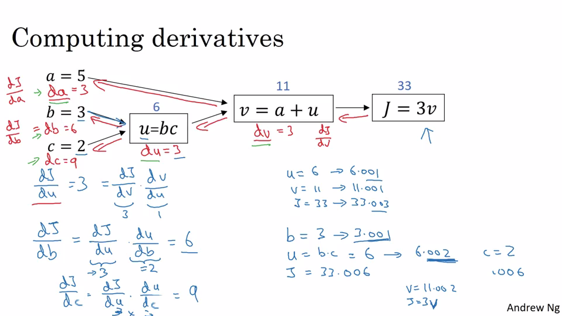

### Logistic Regression

It is an algorithm for binary classification.
Its really important to understand notation used for computing formulaes.
- m is no of training examples.
- let's see what is n.

Assume you have 64x64 pixels of an image. Every image is represented as R,G,B, each having 64x64 pixels, represented as matrices.

So n value becomes 64x64x3, which is one dimentional vector of dimension nx1.( Basically we have converted image into one dimentional vector)

### Loss Function

We can use square error ( as 0.5x(y'^2-y)) but it is not used as it is non-convex and gradient descent cannot find optimum solution for that.
>

So we define another function which is convex and optimum solution can be calculated.

It is defined as:

>lossF

It is used for single training example.

### Why Cost Function?
Lost function is used for single training example. For multiple training, we use cost function. It determines the cost of the parameters w and x. So your x and w should contain value such that it will minimize the cost function, as shown below.

Note:Non-Convex functions are those funcitons which have more than one local optima.

### Derivatives with computational graphs 

### Logistic Regression - m examples

## Why Vectorization?
For computing value for J, we need two for loops. One for training m exmaples, and other, for n number of features.
 
This will be very less efficient and time consuming. Here comes concept of Vectorization.  
It is used for getting rid of using explicit for loops.

Logistic Regression Output :

### Broadcasting
This will also help to compute fast calculations in python.

