## Neural Networks 

### Hidden Layers 

>
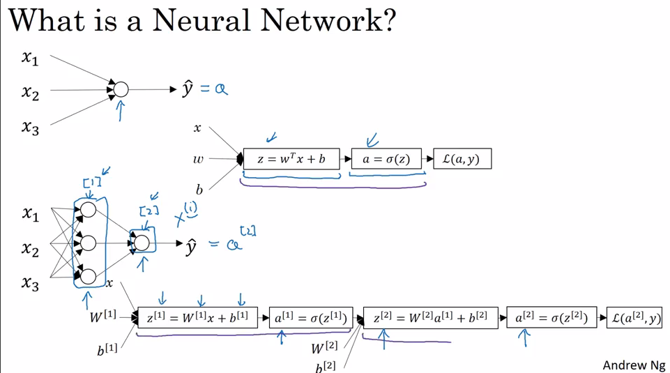

>
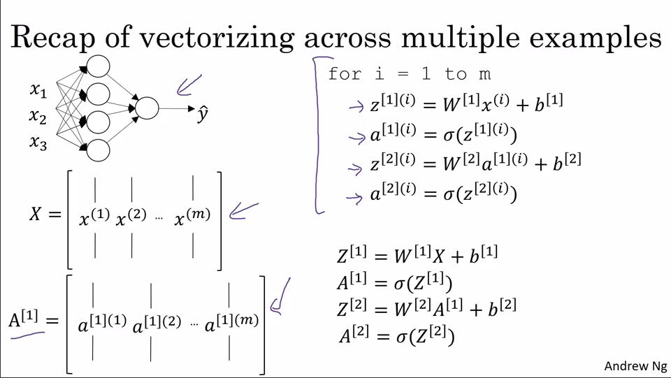

### Why tanh activation funciton?
tanh function ranges from -1 to 1, so the mean comes out to be 0. Hence, this centralised the data which help model to learn little bit easier, as compared to mean 0.5 in sigmoid function (ranges from 0 to 1).

 
Note : Sigmoid function is used rarely. One exception is, it is used in output layer, as we want output to be either 0 or 1
(Binary classification).

>
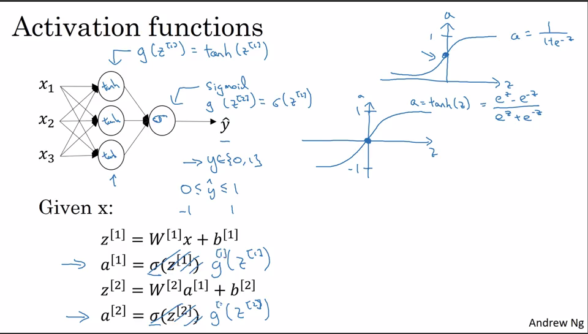

### Why ReLu function?
As Z increases, it decreases slope, hence slows down the gradient descent. So, we defined ReLu function in which, derivative(slope) is 1 if Z is +ve and derivative is 0, is Z is -ve.

>
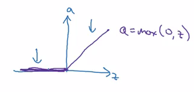

**If you dont know what activation function you should use, then go for ReLU ACtivation Function.**

### Activation Functions 
>
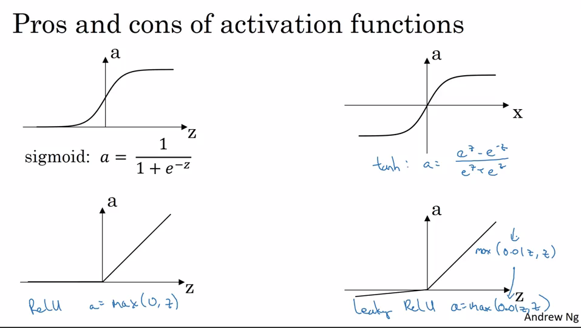

### Why non-linear activation function?
If we have neural network consiting of hidden layers, then using linear activation funciton, turns out to be similar to neural network having only one layer. So going deep into hidden layers will be of no use. Hence we use non-linear AF, so that hidden layers play major role in computing output. 

>
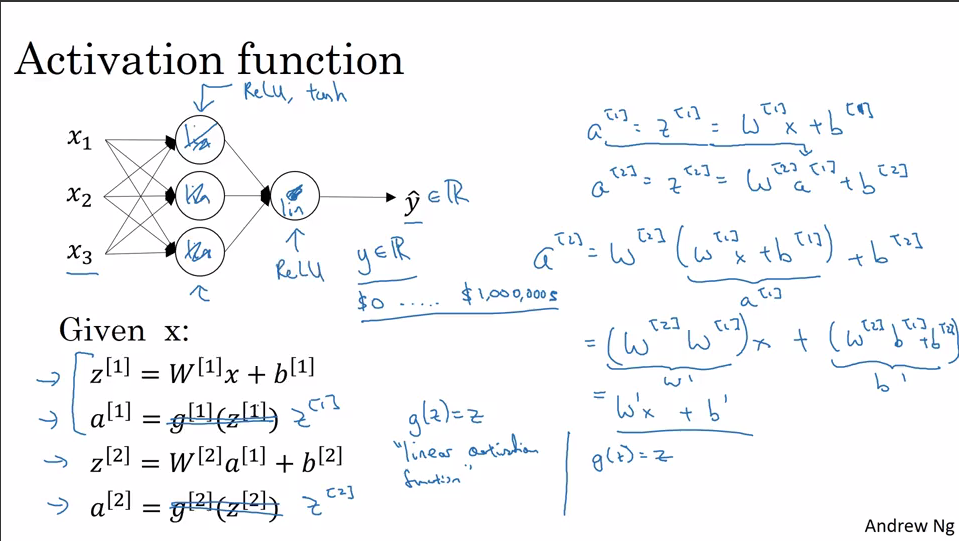

### Derivatives of Activation functions
>
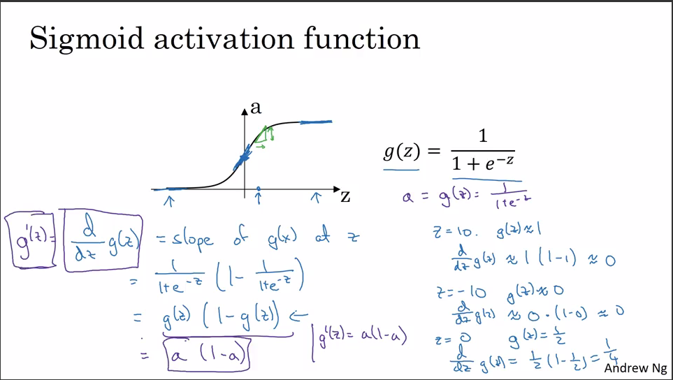

>
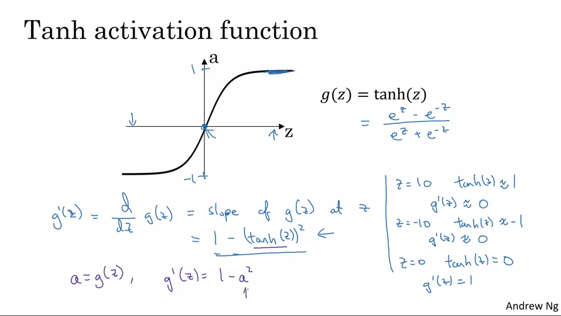

>

### Formulaes used in BackPropogation 
>
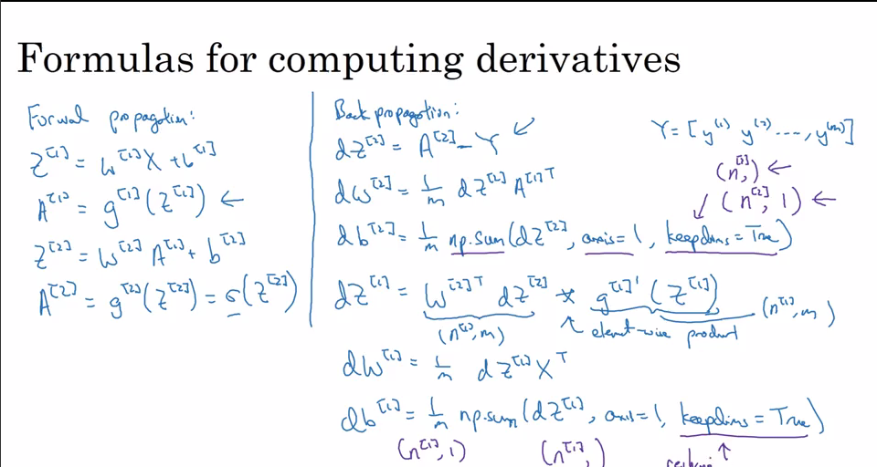

### Backpropogation intuition

**RECAP**

>
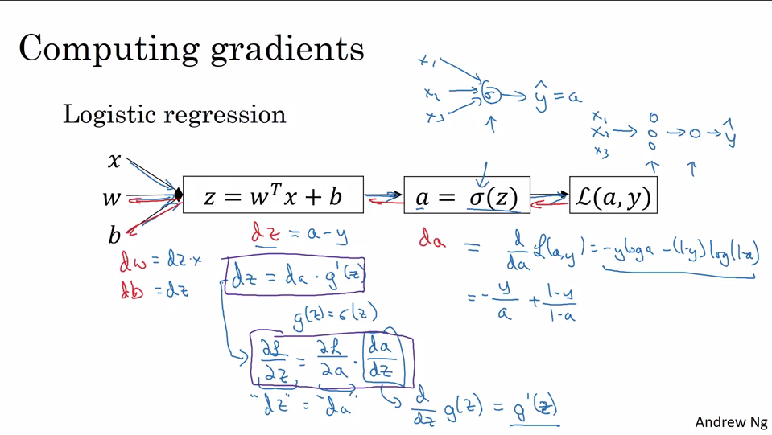

>
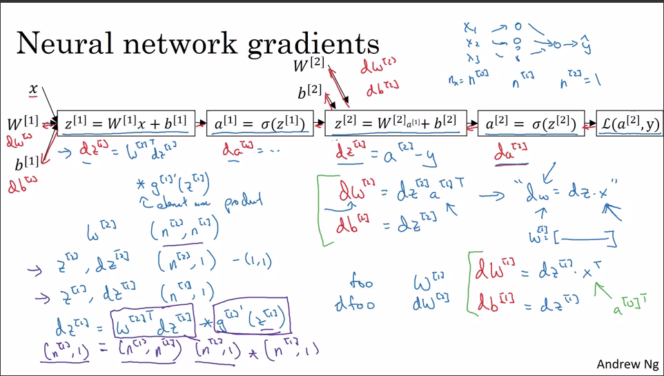

>
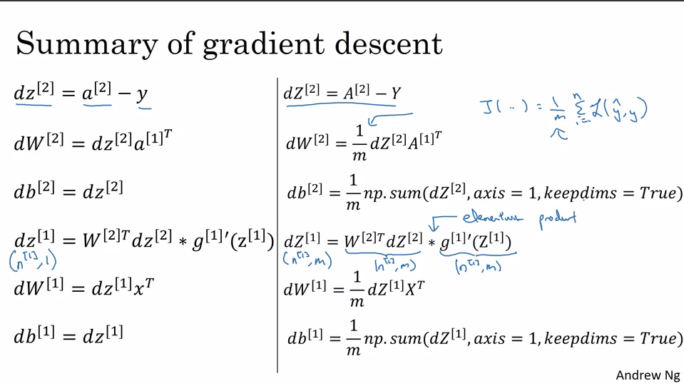

### Why Randomization?
Suppose you have built a neural network. You decide to initialize the weights and biases to be zero. 
 
In that case, each neuron in the first hidden layer will perform the same computation. So even after multiple iterations of gradient descent each neuron in the layer will be computing the same thing as other neurons. Therefore, randomization is very important in which we initialize weights to some random numbers, instead of initializing them to zero.

