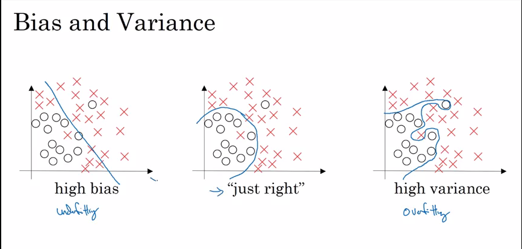

### What do you need?
>NNvalues

# Setting your Ml Application
## Train/Dev/Test-Divide and Predict
Divide your data into 
- Training Set
- Development Set
- Test Set

**Role of Development Set is to test different algorithms on it and see which algorithm works better.Also 60-20-20 is perfect ratio for training-dev-test respectively**
 **Goal od test set is to give you final estimate of your final model network**

**People mostly call dev set as test set, but this terminology is not correct as they are overfitting to the test set.**

## Bias and Variance

High variance measn overfitting the data and High bias means underfitting the data, as shown below:

>BVerror

## Basic Recipe for ML
- high bias?[training data performance] -> [big network, train longer]

- high variance[dev set performance] -> [more data, regularization]

>recipe

# Regularization
It is used to remove high variance problem.
L2 Regularizaion in Logistic Regression:
>l2r
 
 L2 Regularizaion in Neural Network:
 >l2rnn

 ### Why regularization reduces overfitting?
 If lambda is too large, it will make W comes to 0[most of the values becomes 0 in matrix], therefore neural network becomes much smaller.

 
Hence, this overfitting case become much closer to high bias(underfitting) case. So there would be intermediate value for lambda, which makes balance between above cases.

Another explanation :
If z takes relatively small range(close to 0), then tanh function will act like linear function.
>aeR

### Dropout Regularization
Another kind of regularization as L2 reg.
>dr
So this tells - toss a coin(keeping node or remove it) and based on that, drop the node as shown above.
>dropout

**Note : Value for keep-prob varies acc to layer wise. Higher dimension will have low value of keep-prob and vice-versa (as lower dimension will have less prob of going into overfitting, so we can remove more nodes from that layer.)**

Drawback of dropput : There is no well defined cost function(J), as in every iteration, we are changing the value. 
Solution : Keep drop out to 1, then calculate J and make sure it is monotonically decreasing, then set set dropout to some value.

