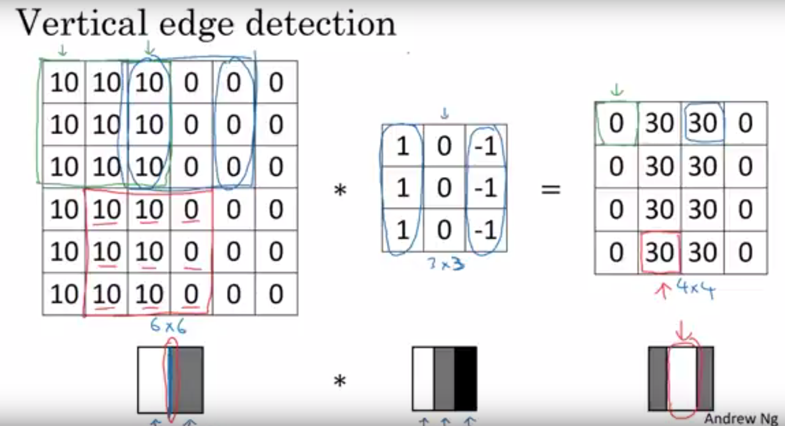
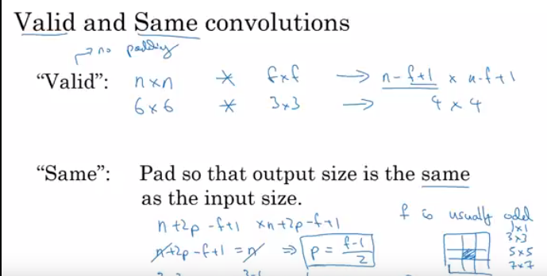
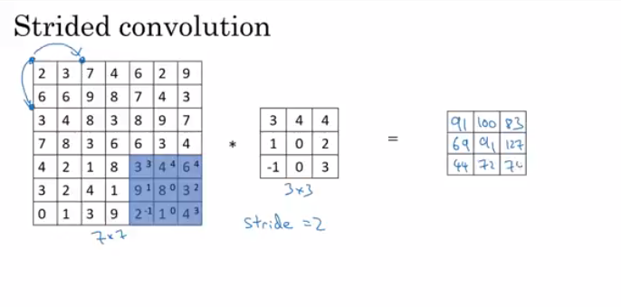
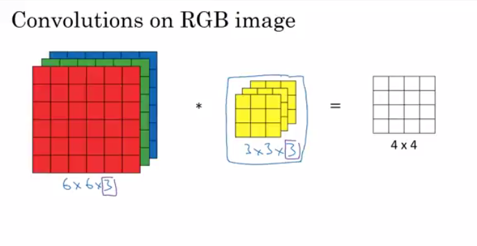
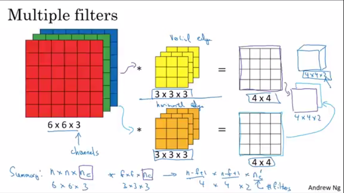
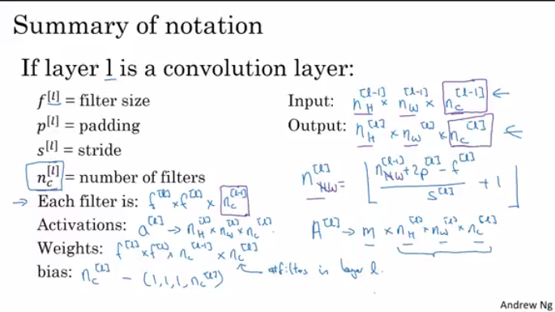
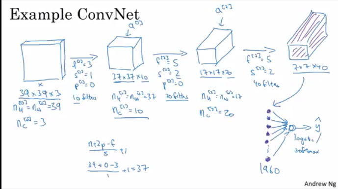
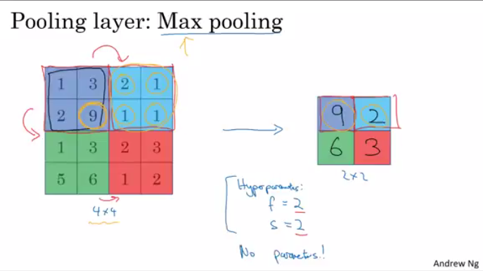
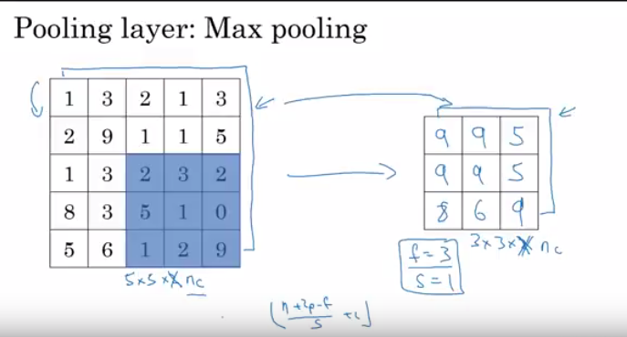
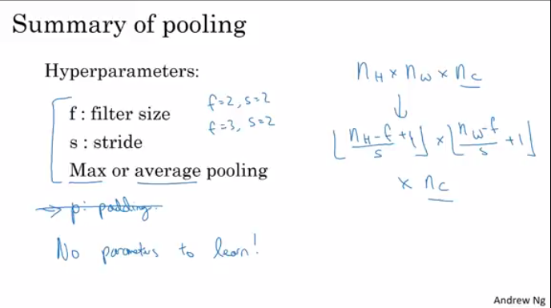

# Convolution Neural Nets
Some of the applications of computer vision can be :
- Image Classification  : For instance, Cat or Dog
- Object Detection : Self driving cars
- Neural Style Transfer : Combining two images

## Why?
High resolution image (considering 1000x1000x3 = 3 million) resolution will be very very difficult for a neural network in respect of computational time and cost. But using high res. images will be good as no one wants to use low res. image. Thus, here comes Convolution Neural Nets

### Edge Detection

>
### Padding - Why?
We face mainly two problems in cnn :
- shrinking
- throwing away lot of information from the edges - corner edges are used only once.
Formulae for padding - n+2p-f+1

>

### Strided Convolution
Take two steps instead of one step. 
Dimension will be calculated as : (n+2p-f)/s + 1 x (n+2p-f)/s + 1 
 

>

### Convolution over 3D images

>

No of features you are measuring is no of channels in the output image.
For instance, below, we are measuring two features, one filter is used for measuring vertical edges, and another is used for horizontal edges, hence the output image will be having 4x4x2 channels.(as 2 features are measured)

>

### Summary of notation

>

### Simple Conv. network example

>

## Pooling
If any quadrant is detecting feature, keep high number for that quadrant. But if feature doesn't exist, then max of upper right quad.(all those numbers) is itself is small.

>

**No of channels in output image is same as no of channels in input image.** And the maxpooling concept is done independently on these channels.

>

**We can also use average pooling, but it is not used very often [Max pooling is much more used than average pooling.]**. It can be used in very deep network. 
**Also max pooling does not use padding or say used very rarely.**

Summary :

>

### Example of CNN
Conv layer and pool layer is considered as layer 1. [Layer that weights are counter as layers,so pool layer has no weights, its only hyperparameters. Hence, this is not considered as seperate layer.]

### Why Convolutions?
- It will decrease the size of training parameters. 
For example, input image has 32x32x3 size(which is 3072) and use 6 filters of size 5x5, then next layer size will be 28x28x6(which is 4704). 

Conv net has relatively small parameters bcecause :
- 1. Parameter remains that same and is used in all the parts of image.
>reasonParam
 

- 2. That one 0 on right hand side, is depend on only 9 features of input image out of 36 features(6X6). Others dont afftect it at all.
>2ndreason 

>alltogether

### In programming assignments :

#### Step by step :
- Don't forget to multiply stride with h and w to calculate vertical and horizontal edges.
- To match dimension, we will use W[...,c] and b[...,c].

