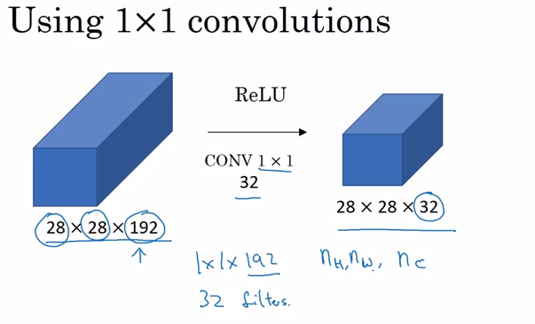

## LeNet - 5
- It is used for recognizing hand written digits on the gray scale images of size 32x32x1.

## AlexNet 
- It has 60 million parameters whereas LeNet has 60 thousand parameters
>

## VGG-16
>

## ResNet
- Used for large deep neural networks
>

#### Why ResNet?
In plane netowrks, if you chose deep layer network, then your training error starts to decrease first, but then increase suddenly.res
>

#### How ResNet works so well?
When you chise deep networks, it makes very difficult to choose parameters to learn which is why a lot of layers end up making up result worse, instead of making it better.
In ResNets, skipping two layers doesnt hurt the performance (as w[l+2] and b[l+2] becomes 0 and ends up in calculating g(a[l]))
>

## Convolve by 1x1 filter:
It allows us to shrink the number of channels in volumes and or keep it a same or increase if we want.
>

### Magic of using 1x1 filter 
>

## Inception Network
If we are confused which filter size we use (1x1 or 3x3 or 5x5), or use max pooling filter, it is kind of tricky. Inception says, why can't we use them all?  
It makes architecture little but tricky, but it is also remarkable better in respect of output.
>

You may wonder how do we change and keep size same in all.
Well, the answer is padding and using stride.
**Computation cost is the disadvantage**
How to calculate computaion cost?
We multiply (no of filters size)x(output size) = (5x5x192)x(28x28x32) = 120M
>

#### Magic of bottleneck - 1x1 filter
>

### Data Augumentation
- Mirroring
- Random Crop
- **Color shifting**

### Applications
- Computer vision
- natural language processing
- speech recognition
- online advertising
 

