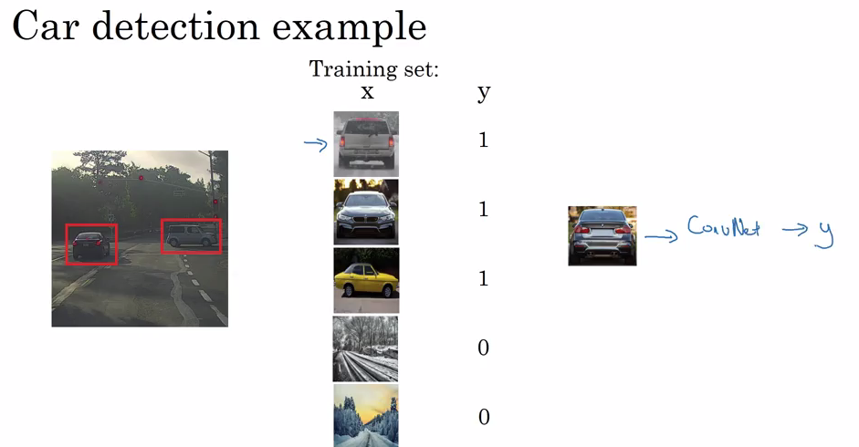

# Object Detection 

### Localization - Identifying/Figuring out where the picture is, in the given image.

If there is an object, then you should return 
- bx
- by
- bh
- bw (positions of bounding box)
- and from which class it belongs to.
 
Pc - IS there any object or not. 1 if yes, 0 if no.
Four classes can be :
- pedestrain
- car
- motorcycle
- background - when no object is found, then return background.
>

## Detection Algorithms
>

### Object Detection
- Convert object into training set and testing set.
Training set contains close images.
>

### Implement Sliding Window convolutionally
- First detect with small window
- Then with larger window.

**Disadvantage**
- Computational Cost
- Building boxes are mot going to be accurate 
[Solution - You only look once(YOLO)]
>

>

### Bounding Box predictions
>

### Intersection over Union
Size of interesection / size of union
**Answer is correct if IOU is >=0.5**
>

### Non-max suppression
All three can detect that they also found a car.
So waht Non-max suppression does, is - It cleans up this detection.
Calculate probabilities and eliminate others.
>

How it cleans up :
>

Algorithm :
>

### Anchor boxes
What if mid point of car and pedestrain lie on same point.
>

Where this algo fails :
- If we have two anchor boxes and having 3 objects in same grid cell.
- If we have two objects associated with same grid cell but both of them have same anchor box shape.
>

### YOLO algorithm
Let's put these, all together.
 
**Training**
>

For simplicity, we took 3x3, but in real time, we use 19x19 grid cells.

