# Face Recognition
### Verification vs Recognition
>
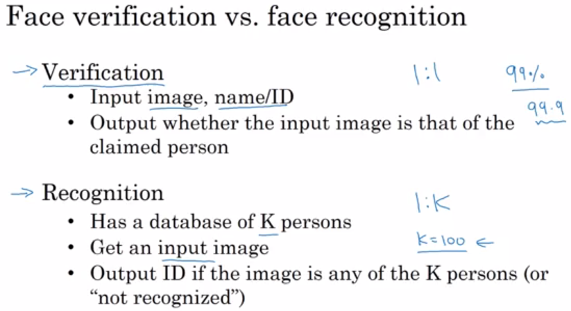

### One Shot Learning
It means you will be given only one shot to recognize that person.
 
Feeding images into CNN and using softmax funciton as an output, will not work here.
Two reasons :
- Dataset is very small so it will not be able to predict only with one image during testing.
- Suppose new person came,  then do we need to retrain our model?
This isn't a good approach.Here comes One Shot : Learning similarity function

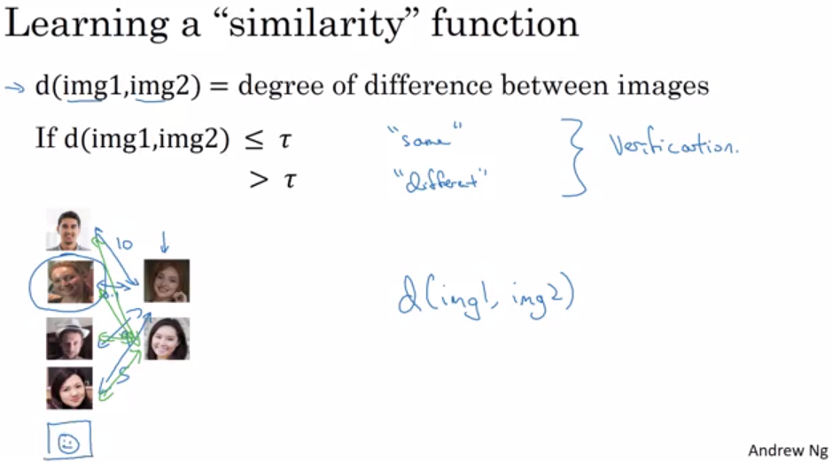

But how to calculate d?
**Lets look at Siamese network**

### Siamese network
>
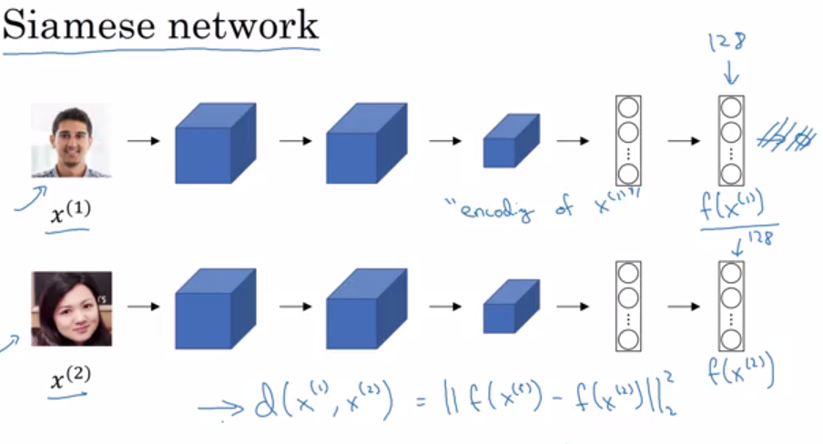

### Triple loss
For this, we need to compare pair of images
 
Triple - We will be looking at three images, simaltaneously
- Anchor 
- Positive
- Negative
>
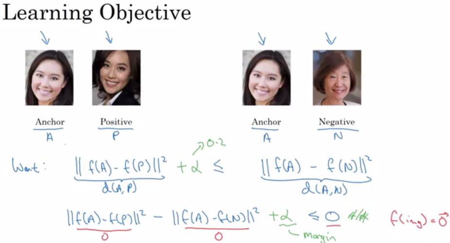

>

**Loss Function**
>
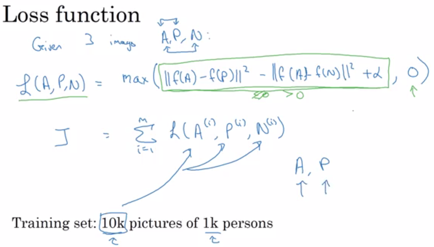

How will we choose parameters - A,P,N
We can't chose them randomly. 
>
<!-- 
 -->

### Binary Classification
Face Verification's another method.
- 1=Same persons
- 2=Different persons

# Neural Style Transfer
What is NST?
>
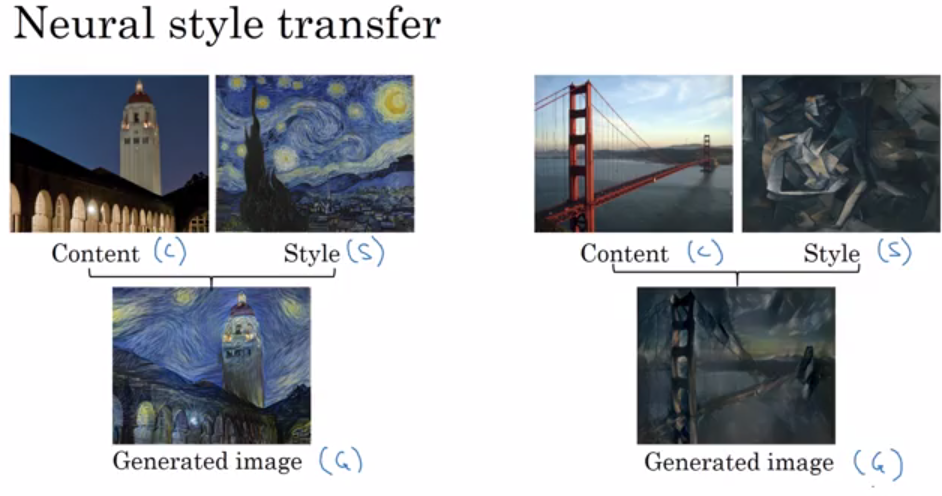

**How better is the generated image?**
Define cost function : J
>

In order to actaullly generate new image, do the following :
>generatedI

There are two things :
- Content cost function
- Style cost function

Overall cost function of NST :
>
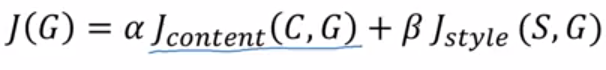

The first part is chosen somewhere in the middle, neither to shallow, nor to deep.
### Content Cost function
>
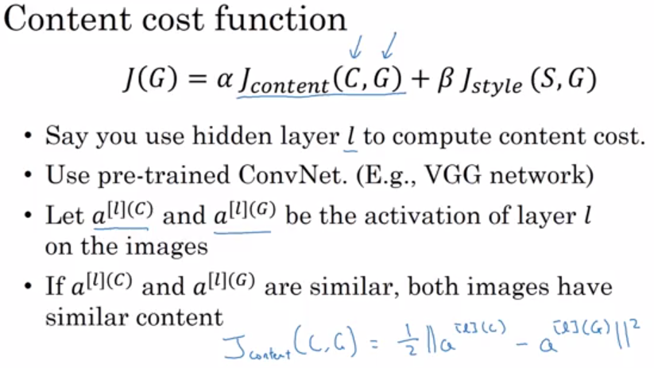

### Style Cost function
>
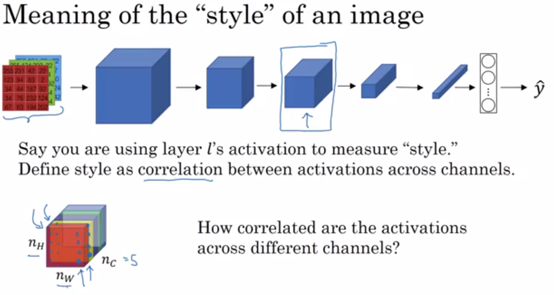

>
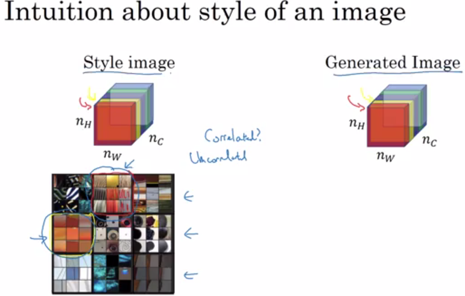

If they are highly correlated, G will be high. Otherwise, it will be small.

Style Matrix :
>
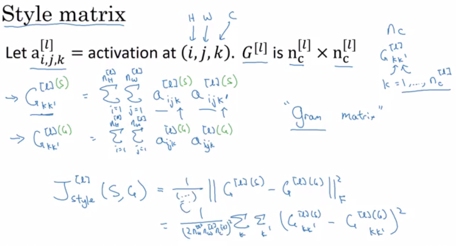

### 1D and 3D generalizations
**1D** :
>
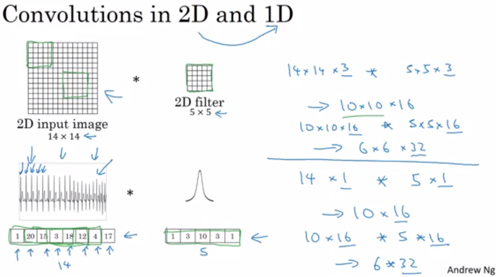

**3D:**
>
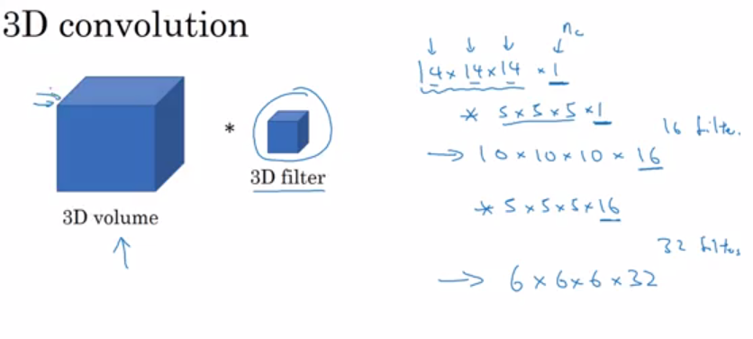

