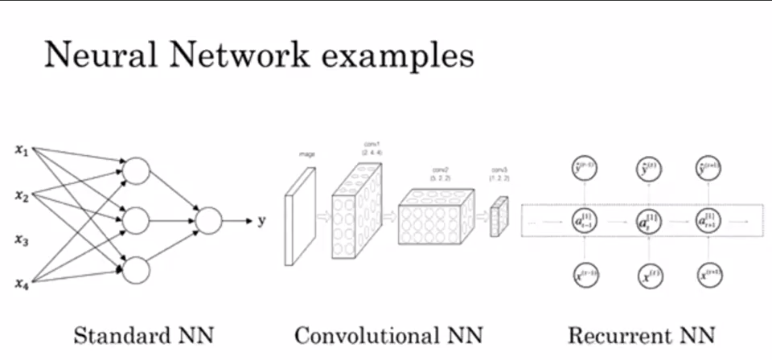
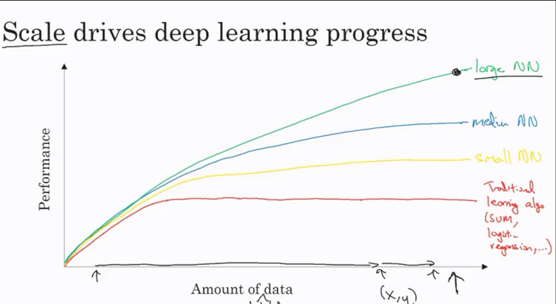
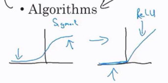
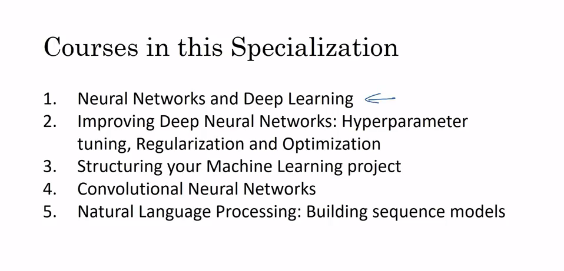

Most of the basics are covered in <a href="https://github.com/bodhwani/Machine-Learning">Machine Learning Repository</a>
In this repo, lets discuss about neural network and deep learning.

#### I mainly focused on WHY for each concept. You can find and learn concepts through Google, but no one explains WHY. So here, I tried to mentioned what is the logic behind and WHY we are using that (as taught by Andrew Ng).

### Supervised Learning
Different neural networks are used for different applications
- For real state and online advertising,  we use standard neural network 
- For image, we use CNN
- For sequence data, for eg, audio, is we often use RNN. Languages are also represented as sequence data.
- For autonomous driving, we use complex or hybrid neural network

**Structured data :**
Features have well defined meaning

**Unstructured data :**
Example can be, audio, image or text. Here features can be pixels in images, or words in text. 
 
Here comes Deep Learning concepts. Computers are able to determine features of unstructured data more easily.

### Why deep learning?

> Use ReLu function instead of Sigmoid function, as learning rate changes very slowly in Sigmoid function, where slope becomes zero. This is not the case with ReLu function.

### Why this course?
What you will learn in this course?

